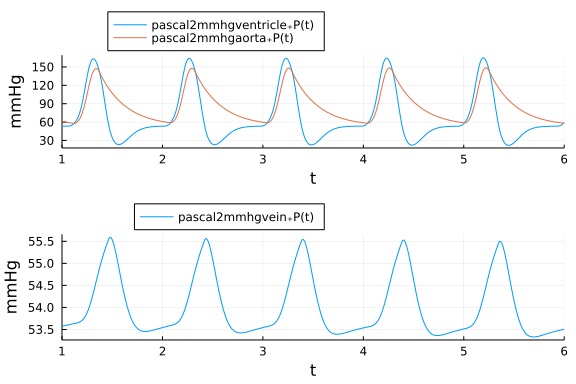
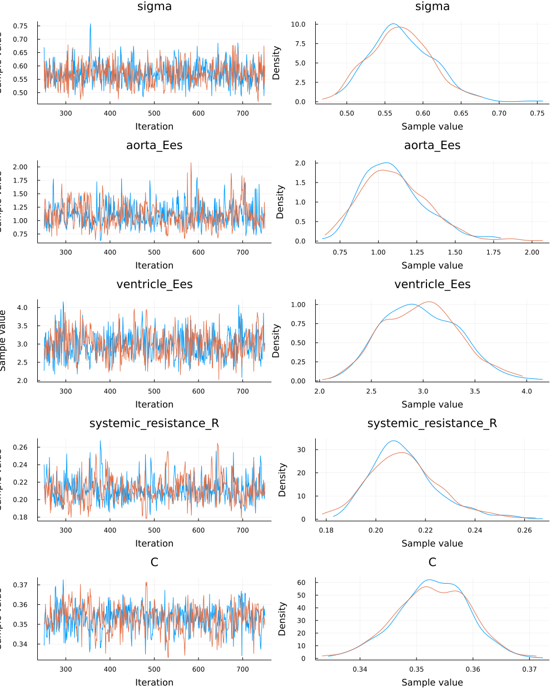
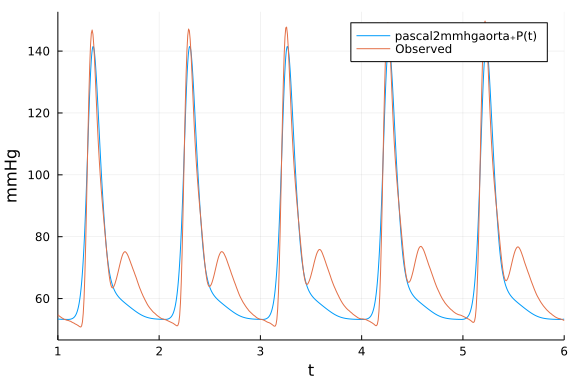

# Parameter estimation of simple 3-compartment model

  > **Notice**, I do not really know how to do this. This aproach may be incorrect and is most likely highly inefficient 

In this demo we use Touring.jl to estimate two parameters of a 3-compartment model.
A simple model with a ventricle, an artery (aorta) and a vein, connected with some resistance between them.

```julia
using OrdinaryDiffEq, ModelingToolkit, CardiovascularModels 
using Plots, StatsPlots
using Turing
using CSV, DataFrames, DataFramesMeta
```


## Load observed data

Load arterial blood pressure waveform, ventilator pressure and volume waveform, and 
timings of QRS-complexes (initiation of the heart beat).

```julia
abp = CSV.File("data/abp.csv") |> DataFrame 
vent = CSV.File("data/vent.csv") |> DataFrame
qrs = CSV.File("data/qrs.csv") |> DataFrame

# Convert pressure to Pascal
mmHg2pascal(mmHg) = mmHg * 133.322
@transform!(abp, :ABP_pascal = mmHg2pascal.(:ABP))

abp_plot = plot(abp.seconds, abp.ABP, labels = "ABP");
vline!(abp_plot, qrs.seconds, labels = "QRS");
airway_vol_plot = plot(vent.seconds, vent.volume, labels = "Airway volume");

plot(abp_plot, airway_vol_plot, layout = (2,1))
```


Now we compose the model

```julia
@variables t
D = Differential(t)

#left Ventricle
@named l_ventricle = Ventricle(Ees = 200e6,
    Vd = 0., V0 = 0., λ = 33e3, P0 = 10.)

# This cardia driver function uses a vector of qrs complexes 
# to indicate when a contraction starts.
@named card_driver = qrsDriver(qrs_times = qrs.seconds)

@named aortic_valve = Valve(R = 6e6)

# Aorta
@named aorta = Vessel(Ees = 200e6, Vd = 100e-6)

@named systemic_resistance = Resistor(R = 50e6)

eqs_driver = [
    l_ventricle.drv ~ card_driver.contraction
]

@named vein = Vessel(Ees = 5e6, Vd = 500e-6)
@named mitral_valve = Valve(R = 10e6)

# Connect systems in series.
# vein.out -> mitral_valve.in
# mitral_valve.out -> l_ventricle.in
# etc.
eqs_con = serial_connect(vein, 
    mitral_valve, 
    l_ventricle,
    aortic_valve,
    aorta,
    systemic_resistance,
    vein)

eqs_comb = [eqs_driver; eqs_con]

# ODE parameters
volume_start = [l_ventricle.V => 1e-4, 
    aorta.V => 1.5e-4,
    vein.V => 2e-3]
time_span = (0.0, 10.0)

@named hemo_sys = ODESystem(eqs_comb)

@named connected = compose(hemo_sys, l_ventricle, card_driver, 
                            aortic_valve, aorta, systemic_resistance, vein, mitral_valve)

problem = ODEProblem(structural_simplify(connected), volume_start, time_span, [])

sol = solve(problem, AutoTsit5(Rosenbrock23()); dtmax = 0.01, reltol = 1e-6)
```


```julia
pascal2mmhg(t, pascal) = t, pascal * 0.00750062
m32ml(t, m3) = t, m3 * 1e6
```

```
m32ml (generic function with 1 method)
```


# Plot of solution before parameter estimation

## Volume plots [ml]
```julia
plot_v1 = plot(sol, vars=[(m32ml, 0, l_ventricle.V), (m32ml, 0, aorta.V)], tspan =  (1,6));
plot_v2 = plot(sol, vars=[(m32ml, 0, vein.V)], tspan =  (1,6));
plot(plot_v1, plot_v2, layout = (2,1), ylabel = "ml", legend = :outertop)
```


## Pressure plots [mmHg]
```julia
plot_p1 = plot(sol, vars=[(pascal2mmhg, 0,l_ventricle.P), (pascal2mmhg, 0,aorta.P)], tspan =  (1,6));
plot_p2 = plot(sol, vars=[(pascal2mmhg, 0, vein.P)], tspan =  (1,6));
plot(plot_p1, plot_p2, layout = (2,1), ylabel = "mmHg", legend = :outertop)
```




# Parameter estimation with Touring.jl

We use Turing.jl to estimate four of the model parameters.

- aorta.Ees is the elasticity of the aorta; the high pressure vessel in the system.
- l_ventricle.Ees is the extra elasticity of the left ventricle during maximum contraction.
- systemic_resistance.R is the resistance of the systemic resistance.
- C is the time (seconds) from the QRS-complex (initiation of the heart beat) the maximum 
  contraction.

```julia
# Extract default parameter values for the ModelingToolkit model.
p_def = ModelingToolkit.defaults(connected)

# Get the names of the parameters in correct order. Used to pass a vector of 
# parameters correctly.
p_order = parameters(connected)

@model function fitParams(observed, prob, p_order, p_def)
    # Prior distributions (quite arbitrarily chosen)
    sigma ~ Gamma(1.5, 2) # rescaled by 1/2000
    # Ees is the elasticity of the aorta.
    aorta_Ees ~ truncated(Normal(1, 0.5), 0, 10) # rescaled by 1/200e6
    # l_ventricle_Ees is the elasticity of the left ventricle during contraction
    l_ventricle_Ees ~ truncated(Normal(1, 0.5), 0, 10) # rescaled by 1/200e6
    systemic_resistance_R ~ truncated(Normal(1, 0.2), 0, 100) #rescaled by 1/50e6
    # C is the time from QRS to peak contraction
    C ~ truncated(Normal(0.2, 0.1), 0, 1)

    # Update parameters.
    # varmap_to_vars converts a dictionary of parameter values to a correctly ordered vector.
    pnew = ModelingToolkit.varmap_to_vars([aorta.Ees => aorta_Ees * 200e6,
                                           l_ventricle.Ees => l_ventricle_Ees * 200e6,
                                           systemic_resistance.R => systemic_resistance_R * 50e6,       
                                           card_driver.C => C], 
                                                            p_order, 
                                                            defaults = p_def)

    # Simulate model. 
    model_sol = solve(prob, Tsit5(); 
                      p = convert.(typeof(aorta_Ees), pnew), 
                      saveat = observed.seconds, # Save at the times of the observations.
                      dtmax = 0.01, reltol = 1e-6)

    # Observations
    
    # Calculate likelihood
    for i in eachindex(observed.ABP_pascal)
        observed.ABP_pascal[i] ~ Normal(model_sol[aorta.P,i], sigma * 2000)
    end

    return nothing
end

# Fit parameters to seconds 1-6 of the data. Every 10th observation.
# We do not fit to the first second to give the ODE time to stabilize.
abp_1to6 = filter(:seconds => x -> 1<x<6, abp)
model = fitParams(abp_1to6[1:5:end,:], problem, p_order, p_def)

# Sample initial values form priors
paraminfo = Turing.VarInfo(model);
init_params = [paraminfo[Turing.SampleFromPrior()] for x in 1:3]
# Sample 3 independent chains with forward-mode automatic differentiation (the default).
chain = sample(model, NUTS(), MCMCSerial(), 500, 2; progress=true, init_params = init_params)

plot(chain)
```




Get the mean of the posterior distribution of the parameters.
We should of course explore the effect of the entire distribution,
but this is just a quick example. For an idea of how to better explore potential solutions, 
see the [guide to Bayesian differential equations](https://turing.ml/dev/tutorials/10-bayesian-differential-equations/)
from the Turing.jl documentation.  

```julia

mean_aorta_Ees = mean(chain[:aorta_Ees])
mean_l_ventricle_Ees = mean(chain[:l_ventricle_Ees])
mean_systemic_resistance_R = mean(chain[:systemic_resistance_R])
mean_C = mean(chain[:C])

p_new = ModelingToolkit.varmap_to_vars([aorta.Ees => mean_aorta_Ees * 200e6,
                                        l_ventricle.Ees => mean_l_ventricle_Ees * 200e6,
                                        systemic_resistance.R => mean_systemic_resistance_R * 50e6,
                                        card_driver.C => mean_C], 
                                                            p_order, 
                                                            defaults = p_def)

sol_fit = solve(problem, Tsit5(); p = p_new, dtmax = 0.01, reltol = 1e-6)

plot_p1 = plot(sol_fit, vars=[(pascal2mmhg, 0,aorta.P)], tspan =  (1,6),
                ylabel = "mmHg");

plot!(plot_p1, abp.seconds, abp.ABP, label = "Observed")
```


