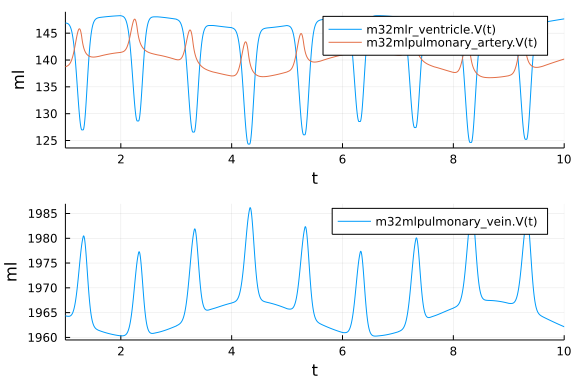
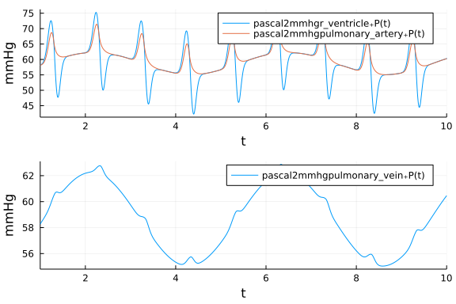
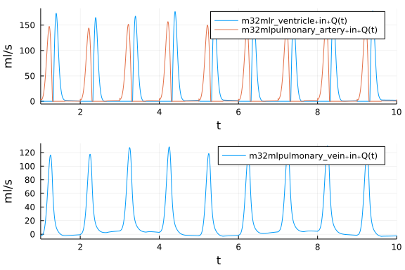

# Simple lung model

A simple model with a ventricle, an artery and a vein, connected with some resistance between them.
The vein is under a cyclic pressure immitating ventilation. 
The simulates a simple arterial pressure variation.

```julia
using OrdinaryDiffEq, ModelingToolkit, CardiovascularModels, Plots

@variables t
D = Differential(t)

# Right Ventricle
@named r_ventricle = Ventricle(Ees = 50e6,
    Vd = 0., V0 = 0., λ = 50e3, P0 = 5.)

@named card_driver = Driver()

@named pulmonary_valve = Valve(R = 6e6)

# Pulmonary artery
@named pulmonary_artery = Vessel(Ees = 200e6, Vd = 100e-6)

@named pulmonary_resistance = Resistor(R = 10e6)

eqs_driver = [
    r_ventricle.drv ~ card_driver.contraction
]


# A simple cosine wave to immitate a respiratory pressure variation
pulmonary_pressure(t, resp_rate = 14, p_max = 1e3) = 0.5 * p_max * (1-cos(2 * π * t * 14/60))
@register pulmonary_pressure(t)

@named pulmonary_vein = Vessel(Ees = 5e6, Vd = 500e-6, ext_pressure = "free")
@named tricuspid_valve = Valve(R = 10e6)

eqs_lung = [
    pulmonary_vein.P_ext ~ pulmonary_pressure(t)
]

# Connect systems in series.
eqs_con = serial_connect(pulmonary_vein, 
    tricuspid_valve, 
    r_ventricle,
    pulmonary_valve,
    pulmonary_artery,
    pulmonary_resistance,
    pulmonary_vein)

eqs_comb = [eqs_driver; eqs_lung; eqs_con]

# ODE parameters
volume_start = [r_ventricle.V => 1e-4, 
    pulmonary_artery.V => 1.5e-4,
    pulmonary_vein.V => 2e-3]
time_span = (0.0, 10.0)

@named hemo_sys = ODESystem(eqs_comb)

@named connected = compose(hemo_sys, r_ventricle, card_driver, 
                            pulmonary_valve, pulmonary_artery, pulmonary_resistance, 
                            pulmonary_vein, tricuspid_valve)

problem = ODEProblem(structural_simplify(connected), volume_start, time_span, [])

sol = solve(problem, Tsit5(), dtmax = 0.01, reltol = 1e-6)
```


```julia
pascal2mmhg(t, pascal) = t, pascal * 0.00750062
m32ml(t, m3) = t, m3 * 1e6
```

```
m32ml (generic function with 1 method)
```


## Volume plots [ml]
```julia
plot_v1 = plot(sol, vars=[(m32ml, 0, r_ventricle.V), (m32ml, 0, pulmonary_artery.V)], tspan =  (1,10));
plot_v2 = plot(sol, vars=[(m32ml, 0, pulmonary_vein.V)], tspan =  (1,10));
plot(plot_v1, plot_v2, layout = (2,1), ylabel = "ml")
```




## Pressure plots [mmHg]
```julia
plot_p1 = plot(sol, vars=[(pascal2mmhg, 0,r_ventricle.P), (pascal2mmhg, 0, pulmonary_artery.P)], tspan =  (1,10));
plot_p2 = plot(sol, vars=[(pascal2mmhg, 0, pulmonary_vein.P)], tspan =  (1,10));
plot(plot_p1, plot_p2, layout = (2,1), ylabel = "mmHg")
```




## Flow plots [ml/s]
```julia
plot_Q1 = plot(sol, vars=[(m32ml, 0, r_ventricle.in.Q), (m32ml, 0, pulmonary_artery.in.Q)], tspan =  (1,10));
plot_Q2 = plot(sol, vars=[(m32ml, 0, pulmonary_vein.in.Q)], tspan =  (1,10));
plot(plot_Q1, plot_Q2, layout = (2,1), ylabel = "ml")
```


