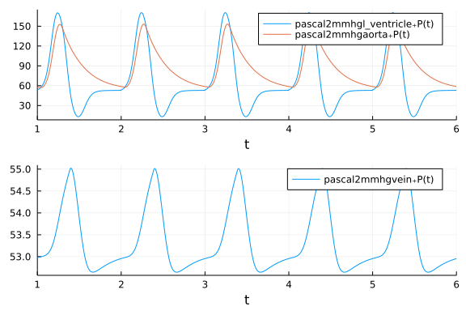

# Simple 3 compartment model

A simple model with a ventricle, an artery (aorta) and a vein, connected with some resistance between them.

```julia
using DifferentialEquations, ModelingToolkit, CardiovascularModels, Plots

@variables t
D = Differential(t)

#left Ventricle
@named l_ventricle = Ventricle(Ees = 200e6,
    Vd = 0., V0 = 0., λ = 33e3, P0 = 10.,
    R_out = 6e6)

@named card_driver = Driver()

# Aorta
@named aorta = Vessel(Ees = 200e6, V0 = 100e-6, R_out = 50e6)

eqs_driver = [
    l_ventricle.drv ~ card_driver.contraction
]

#@named vein = Const_Pressure(P = 1e3, R_out = 6e6, valve_out = true)
@named vein = Vessel(Ees = 5e6, V0 = 500e-6, R_out = 10e6, valve_out = true)


eqs_con = [
    connect(vein.out, l_ventricle.in),
    connect(l_ventricle.out, aorta.in),
    connect(aorta.out, vein.in)
]


eqs_comb = [eqs_driver; eqs_con]

# ODE parameters
volume_start = [l_ventricle.V => 1e-4, 
    aorta.V => 1.5e-4,
    vein.V => 2e-3]
time_span = (0.0, 10.0)

@named hemo_sys = ODESystem(eqs_comb)

@named connected = compose(hemo_sys, l_ventricle, aorta, vein, card_driver)

problem = ODEProblem(structural_simplify(connected), volume_start, time_span, [])

sol = solve(problem, Tsit5(), dtmax = 0.01, reltol = 1e-6)
```

```
retcode: Success
Interpolation: specialized 4th order "free" interpolation
t: 1001-element Vector{Float64}:
  0.0
  0.01
  0.02
  0.03
  0.04
  0.05
  0.060000000000000005
  0.07
  0.08
  0.09
  ⋮
  9.919999999999833
  9.929999999999833
  9.939999999999833
  9.949999999999832
  9.959999999999832
  9.969999999999832
  9.979999999999832
  9.989999999999831
 10.0
u: 1001-element Vector{Vector{Float64}}:
 [0.0001, 0.00015, 0.002]
 [0.00010711177092466281, 0.00014950659196309428, 0.001993381637112243]
 [0.0001140640702830269, 0.00014902611229659706, 0.001986909817420376]
 [0.00012081503903879829, 0.00014855821761683056, 0.001980626743344371]
 [0.00012731018998961944, 0.0001481026253796202, 0.00197458718463076]
 [0.00013348013583079648, 0.00014765912495521901, 0.0019688607392139845]
 [0.00013923889137295505, 0.00014722759024569552, 0.0019635335183813495]
 [0.00014448336037818806, 0.00014680799292861554, 0.0019587086466931964]
 [0.00014909466000113787, 0.00014640041481540304, 0.001954504925183459]
 [0.00015294176787379151, 0.00014600505729586464, 0.001951053174830344]
 ⋮
 [0.0001987600943231968, 0.0001406126262242098, 0.0019106272794525954]
 [0.00019876671598307463, 0.00014040307032766786, 0.0019108302136892595]
 [0.00019877284856021252, 0.0001402019262333304, 0.0019110252252064592]
 [0.00019877855871246853, 0.00014000885647694764, 0.001911212584810586]
 [0.00019878390050385102, 0.0001398235370916418, 0.0019113925624045093]
 [0.00019878891800106748, 0.00013964565707671472, 0.0019115654249222199]
 [0.0001987936473256129, 0.00013947491788552854, 0.0019117314347888606]
 [0.00019879811827572234, 0.00013931103293216885, 0.0019118908487921109]
 [0.0001988023556085705, 0.0001391537271165103, 0.0019120439172749214]
```


```julia
pascal2mmhg(t, pascal) = t, pascal * 0.00750062
```

```
pascal2mmhg (generic function with 1 method)
```


## Volume plots
```julia
plot_v1 = plot(sol, vars=[l_ventricle.V, aorta.V], tspan =  (1,6));
plot_v2 = plot(sol, vars=[vein.V], tspan =  (1,6));
plot(plot_v1, plot_v2, layout = (2,1))
```


## Pressure plots
```julia
plot_p1 = plot(sol, vars=[(pascal2mmhg, 0,l_ventricle.P), (pascal2mmhg, 0,aorta.P)], tspan =  (1,6));
plot_p2 = plot(sol, vars=[(pascal2mmhg, 0, vein.P)], tspan =  (1,6));
plot(plot_p1, plot_p2, layout = (2,1))
```


